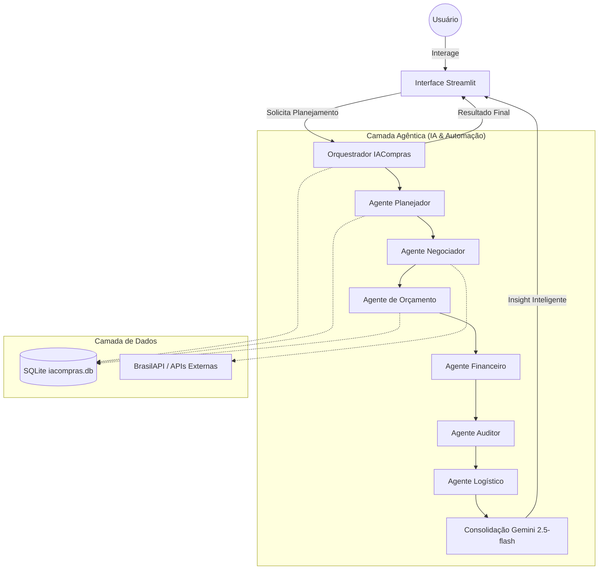

# IACOMPRAS - Camada Agêntica

Este projeto implementa uma camada agêntica completa para o sistema IACOMPRAS, utilizando **Google ADK** (simulado em Python) e o modelo **Gemini 2.5-flash** como orquestrador.

## Estrutura do Projeto

- `src/iacompras/agents/`: Contém os 6 agentes implementados (Planejador, Negociador, Orçamento, Financeiro, Auditor, Logístico).
- `src/iacompras/tools/`: Suite de ferramentas para manipulação de dados Excel, ML, SQLite e APIs externas.
- `src/iacompras/ml/`: Contém o modelo de regressão para previsão de demanda.
- `src/iacompras/orchestrator.py`: Pipeline que coordena a execução sequencial dos agentes.
- `src/iacompras/app_streamlit.py`: Interface web moderna para interação com o sistema.

## Arquitetura do Sistema



## Configuração

1. Instale as dependências:
   ```bash
   pip install -r requirements.txt
   ```
   *(Dependências recomendadas: pandas, openpyxl, scikit-learn, streamlit, requests, sqlite3)*

2. Configure as variáveis de ambiente:
   - `GEMINI_API_KEY`: Sua chave de API do Google Gemini (Pode ser informada diretamente na interface Streamlit).
   - `SENDGRID_API_KEY`: Opcional (Modo Dry-Run ativo por padrão).

## Como Rodar

Execute a interface Streamlit:
```bash
streamlit run src/iacompras/app_streamlit.py
```

## Fluxo de Agentes

- **Orquestrador Gemini 2.5**: Utiliza o modelo `gemini-2.5-flash` para analisar os dados gerados por todos os agentes e criar um sumário executivo inteligente.
2. **Agente Negociador**: Seleciona fornecedores e consulta BrasilAPI para validar CNPJs.
3. **Agente Gerenciador de Orçamento**: Registra cotações no SQLite e simula envio de e-mails via SendGrid.
4. **Agente Financeiro**: Calcula custos totais e projeções de pagamento.
5. **Agente Auditor**: Identifica anomalias de preço e quantidades excessivas.
6. **Agente Logístico**: Define janelas de entrega e analisa riscos de ruptura.

## Banco de Dados (SQLite)
O sistema utiliza um banco local em `data/iacompras.db` para persistir:
- Execuções (runs)
- Itens sugeridos (run_items)
- Cache de fornecedores (suppliers)
- Cotações enviadas
- Logs de e-mail (outbox)

---
*Nota: O envio de e-mails está configurado em modo **Dry-run**, os logs podem ser consultados na tabela `emails_outbox` do SQLite.*
