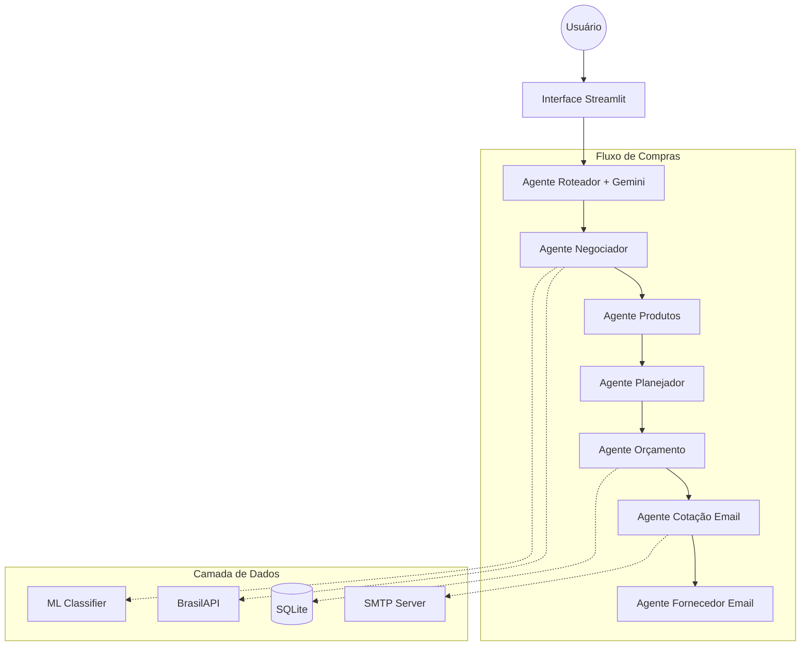

# 🛒 IACOMPRAS - Sistema de Gestão Agêntica de Compras

Sistema de automação inteligente para gestão de compras utilizando **Google ADK**, **Gemini 2.5-flash** e agentes especializados.

## 🎯 Visão Geral

O IACOMPRAS automatiza o fluxo completo de compras através de uma arquitetura multi-agente:
1. **Classificação de Fornecedores** - ML para scoring e categorização
2. **Seleção de Produtos** - Identificação automática de produtos prioritários
3. **Planejamento** - Recomendação de fornecedores por produto
4. **Orçamento** - Geração e confirmação de orçamentos
5. **Comunicação** - Envio automatizado de cotações por email

## 📁 Estrutura do Projeto

```
IACOMPRAS/
├── src/iacompras/
│   ├── agents/                    # Agentes especializados
│   │   ├── agente_roteador.py     # Roteamento de consultas via Gemini
│   │   ├── agente_negociador.py   # Classificação e seleção de fornecedores
│   │   ├── agente_produtos.py     # Catálogo de produtos sugeridos
│   │   ├── agente_planejador.py   # Planejamento e recomendações
│   │   ├── agente_orcamento.py    # Geração de orçamentos
│   │   ├── agente_solicita_cotacao_email.py  # Envio de cotações
│   │   └── agente_fornecedor_email.py        # Confirmações de fornecedor
│   ├── tools/                     # Ferramentas compartilhadas
│   │   ├── data_tools.py          # Leitura de dados Excel
│   │   ├── db_tools.py            # Operações SQLite
│   │   ├── ml_tools.py            # Treinamento e classificação ML
│   │   ├── external_tools.py      # BrasilAPI (consulta CNPJ)
│   │   ├── email_tools.py         # Envio de emails SMTP
│   │   ├── analysis_tools.py      # Scoring de fornecedores
│   │   └── gemini_client.py       # Cliente Gemini API
│   ├── ml/                        # Machine Learning
│   │   └── treinar_classificador_fornecedor.py
│   ├── templates/                 # Templates de email
│   ├── orchestrator.py            # Orquestrador central
│   └── app_streamlit.py           # Interface web
├── data/
│   ├── iacompras.db               # Banco SQLite
│   └── samples/                   # Datasets Excel
├── models/                        # Modelos ML salvos
├── smtp_config.ini                # Configuração SMTP
└── requirements.txt
```

## 🏗️ Arquitetura



## ⚙️ Configuração

### 1. Instalar dependências
```bash
pip install -r requirements.txt
```

### 2. Configurar variáveis de ambiente
```bash
# Opcional - pode ser informada na interface
export GEMINI_API_KEY="sua_chave_aqui"
```

### 3. Configurar SMTP (para envio de emails)
Edite o arquivo `smtp_config.ini`:
```ini
[SMTP_CLIENTE]
HOST = smtp.gmail.com
PORT = 587
USER = seu_email@gmail.com
PASSWORD = sua_senha_app
USE_TLS = true

[SMTP_FORNECEDOR]
HOST = smtp.gmail.com
PORT = 587
USER = fornecedor@gmail.com
PASSWORD = senha_fornecedor
USE_TLS = true
```

## 🚀 Executar

```bash
streamlit run src/iacompras/app_streamlit.py
```

## 📊 Fluxo dos Agentes

| Etapa | Agente | Função |
|-------|--------|--------|
| 1 | **Roteador** | Interpreta consultas e direciona para o agente correto |
| 2 | **Negociador** | Treina modelo ML e classifica fornecedores (Ruim/Médio/Bom/Ótimo) |
| 3 | **Produtos** | Identifica produtos em comum entre fornecedores selecionados |
| 4 | **Planejador** | Recomenda Top 3 fornecedores por produto baseado em score/preço |
| 5 | **Orçamento** | Agrupa produtos por fornecedor e gera orçamentos |
| 6 | **Cotação Email** | Envia solicitações de cotação para fornecedores |
| 7 | **Fornecedor Email** | Simula resposta de confirmação do fornecedor |

## 🗄️ Banco de Dados

O SQLite (`data/iacompras.db`) armazena:

| Tabela | Descrição |
|--------|-----------|
| `runs` | Execuções do orquestrador |
| `run_items` | Itens processados por execução |
| `suppliers` | Cache de fornecedores (BrasilAPI) |
| `orcamento` | Orçamentos confirmados |
| `orcamento_itens` | Itens de cada orçamento |
| `fornecedores_classificados` | Resultados do classificador ML |
| `emails_outbox` | Log de emails enviados |

## 🤖 Machine Learning

O classificador de fornecedores utiliza:
- **Modelo**: Random Forest Classifier
- **Features**: Prazo médio, volume, recorrência, valor médio
- **Target**: Classificação (Ruim/Médio/Bom/Ótimo)
- **Output**: Score 1-5 e classe textual

## 📧 Emails

O sistema suporta envio real de emails via SMTP:
- **Cotações**: Cliente → Fornecedor (solicitação de preços)
- **Confirmações**: Fornecedor → Cliente (confirmação de recebimento)

---

*Desenvolvido com Google ADK e Gemini 2.5-flash*
